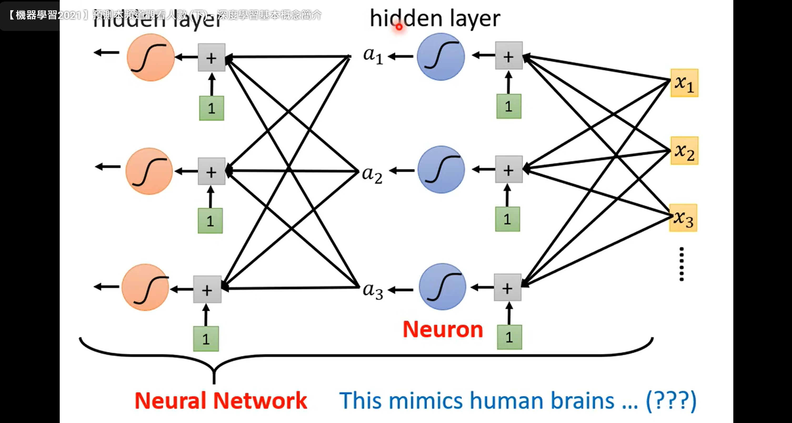
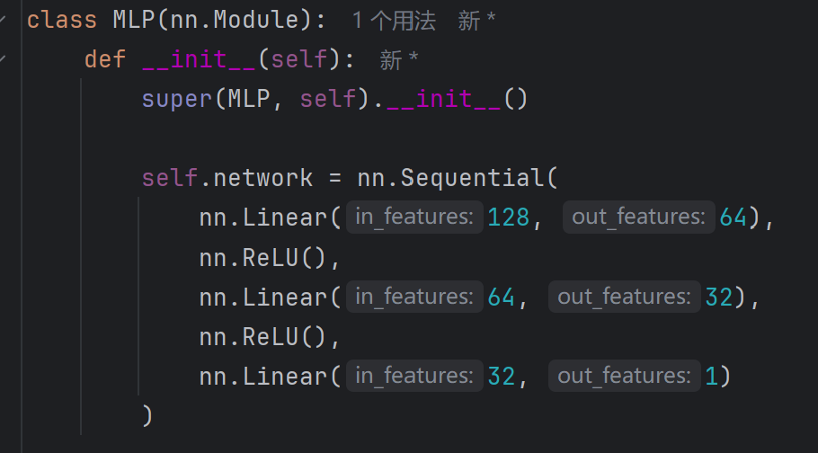

<!-- more -->

# 1.Neural-Network的提出

Neural-Network并不是近二十年才提出的理论，虽然在近二十年，以DeepLearning为名的Neural-Network取得了长足的发展，并在机器学习领域占据了绝对的统治，但Neural-Network的最初提出要远在1960s-1980s。

目前公认的Neural-Network起源是沃伦·麦卡洛克和沃尔特·皮茨在1940s发表的论文《A Logical Calculus of the Ideas Immanent in Nervous Activity》，提出利用“neuron”来构建网络进行计算。虽然被冠以“从生物学中得到灵感”的title，但模型本身的数学是很浅显的、直接的。

最初的Neural-Network,也就是我们今天常用的Fully-Connected-Network,其实是基于函数的拟合来提出的：现在有一大笔数据，我们的目标就是寻找一个带有未知参量的函式f(X)，让它对我们的目标变量Y的预测loss最低。

图片1：looking for a function，引自：国立台湾大学李宏毅老师ML2022(https://www.youtube.com/watch?v=Ye018rCVvOo)

对f(x)分段，每段用y=wx+b的线性函数来逼近，再过一道activation function连接上所有的线性段，最后就形成了类似神经网络的结构。“Neural-Network”这个高大上的名词由此诞生，引发外行人无数天真浪漫的想象，也成为内行人欺骗麻瓜的魔法(*^_^*)。

图片2：Neural-Network，引自：国立台湾大学李宏毅老师ML2022(https://www.youtube.com/watch?v=bHcJCp2Fyxs)

 

在1980s,Neural-Network的训练范式已经形成，也就是我们熟知的MLP：

1.构建一个几层的网络

2.将数据清洗、处理，分成几个Banch来运算

3.前向传播算loss-function

4.SGD(或者带momentum)算梯度，反向传播实现optimize

5.循环训练几个epco，之后再调hyperparameter,得到最终的模型

 

Neural-Network的核心就是下面这段小小的代码：

(ps:当时甚至没有带STL的C++！<即C++98,1998年>更别说python<1990年>,pytorch<2016年>，试想一下先用不含class的c语言来手搓STL，再写这段代码……你懂的)

图片3：MLP核心

 

此时的Neural-Network架构虽然与现代太大差别，但受限于当时的训练数据量与算力，很多时候还没有传统的ML方法如SVM,随机森林等的效果好，neural-network在短暂的震惊世界后迅速沉寂，成为只存在于论文上的理论。neural-network的再一次大放异彩，还要等到20年后。不过，这一次，它换了一个新名字：CNN。

